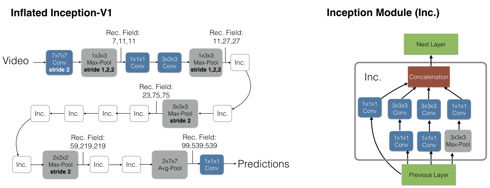

# I3D models trained on Kinetics

## Overview

For this project, I am building an end-to-end trainable behavior recognition system for mice using deep convolutional networks. These networks are inspired from Inception-3d, the current state-of-the-art in video action recognition. Please find detailed information about this architecture in the paper "[Quo Vadis,
Action Recognition? A New Model and the Kinetics
Dataset](https://arxiv.org/abs/1705.07750)" by Joao Carreira and Andrew
Zisserman. The paper was posted on arXiv in May 2017, and was published as a
CVPR 2017 conference paper. Below is an architecture diagram of Inception-3D.

## Running the code

### Setup

1. Follow the instructions for [installing
Sonnet](https://github.com/deepmind/sonnet).

2. clone this repository using

`$ git clone https://github.com/vijayvee/behavior_recognition`

3. Add the cloned repository's parent path to $PYTHONPATH as follows

`cd <parent_dir>/behavior_recognition; export PYTHONPATH=$PYTHONPATH:<parent_dir>`

### Acknowledgments

Brian Zhang, Joao Carreira, Viorica Patraucean, Diego de Las Casas, Chloe
Hillier, and Andrew Zisserman helped to prepare this initial release. We would
also like to thank the teams behind the [Kinetics
dataset](https://arxiv.org/abs/1705.06950) and the original [Inception
paper](https://arxiv.org/abs/1409.4842) on which this architecture and code is
based.

